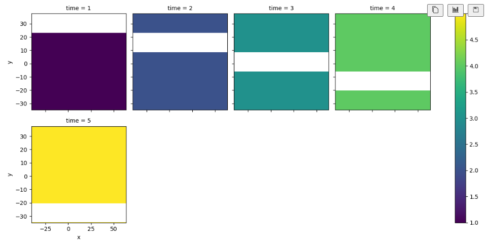
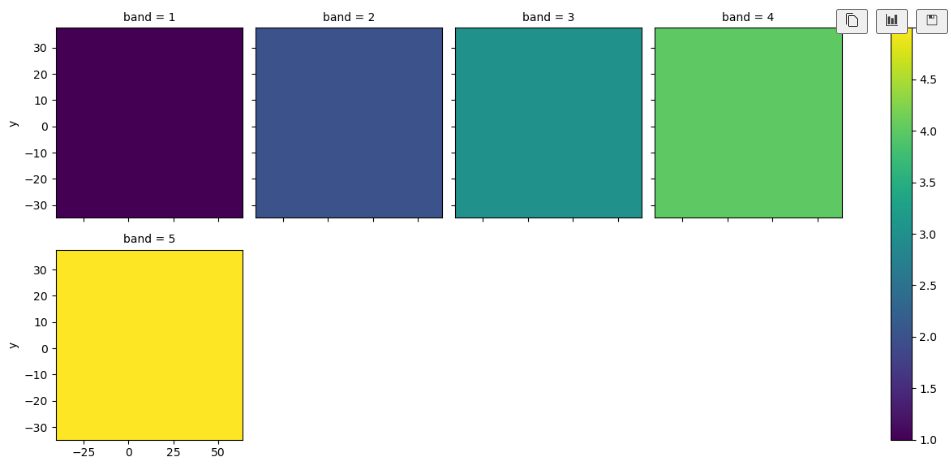
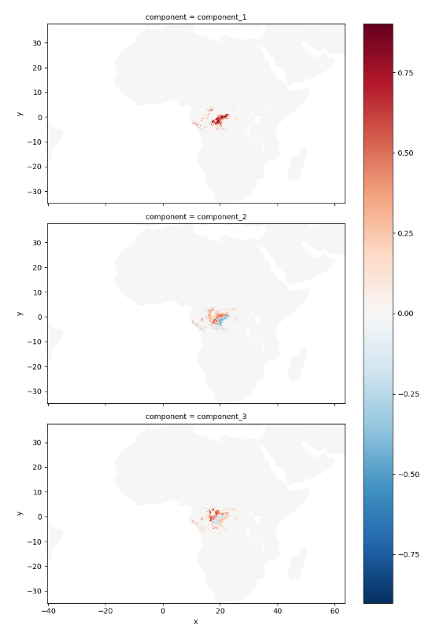

# xr_fresh
[](https://www.python.org)
[](https://github.com/mmann1123/xr_fresh/releases)
[](https://github.com/jgrss/geowombat/blob/main/LICENSE.txt)

[](https://joss.theoj.org/papers/d2f29c3830187e4b75cf6141996f9f0b)
<!-- 
[](https://github.com/mmann1123/xr_fresh/actions/workflows/python-tests.yml)

-->

xr_fresh is designed to quickly generate a broad set of temporal features from gridded raster data time series. NOTE: This only works on single band images, not multiband e.g. rgb etc. If you have multiband you will need to split the bands into individual files.

The main operations of this package are:

1) Extract features from raster data (e.g. mean, minimum, maximum, complexity, skewdness, etc.)
2) Interpolate missing values in time series data
3) Calculate PCA components from raster data

Why use `xr_fresh`?

1) It is designed to be fast and efficient, using parallel processing to speed up the feature extraction process.
2) It can run on a GPU, if available, to further speed up the process.
3) Radically improves feature generation speeds over tabular extracts using ts_fresh as the backend [comparison here](notebooks/time_trial.ipynb)
4) You really should use google earth engine less!


## Time Series Feature Extraction

The package can extract a wide range of features from raster data time series. The features are calculated for each pixel in the raster stack, and the output is a raster file with the same shape as the input stack.  


## Interpolation of Missing Values

The package can also interpolate missing values in raster data time series. The interpolation is done on a pixel-by-pixel basis, and the output is a raster stack with the same shape as the input stack. These processes are parallelized through `jax` to speed up the interpolation process on a CPU or GPU.

Example of dummy data with missing values:


Example of interpolated data:


## Principal Component Analysis (PCA) on Raster Data

The package can also calculate PCA components from stacks of raster data, and can be used to generate new rasters with the PCA components as bands.

Example outputs from PCA components for African ppt data:



## Install

To install xr_fresh, you can use pip. However, since xr_fresh includes a C++ extension module, it requires compilation during the installation process. Here are the steps to install xr_fresh:

### Prerequisites

- Conda or mamba [Instructions here](https://docs.conda.io/projects/conda/en/latest/user-guide/install/index.html)
- C++ compiler (e.g., g++ on Linux, clang on macOS, or MSVC on Windows)

*Linux, OSx & Windows Install*

```
# add dependency
conda create -n xr_fresh geowombat -c conda-forge
conda activate xr_fresh
# clone repository
cd # to desired location
git clone https://github.com/mmann1123/xr_fresh
cd xr_fresh
pip install -U pip setuptools wheel
pip install . 
```  
Note: If you run into problems related to `rle` try running `python setup.py build_ext --inplace` from the `xr_fresh` directory

To run PCA you must also install `ray`.  

```
conda install -c conda-forge "ray-default"
```
Note: `ray` is only is beta for Windows and will not be installed by default. Please read more about the installation [here](https://docs.ray.io/en/latest/ray-overview/installation.html)

## Example

Simple working example

``` python
import os
from glob import glob
import geowombat as gw
from xr_fresh.feature_calculator_series import *

# get list of evi time series images
os.chdir("~/xr_fresh/xr_fresh/data")
files = glob("tests/data/evi*.tif")

out_path = "evi_longest_strike_above_mean.tif"
# use rasterio to create a new file tif file

with gw.series(files) as src:
    src.apply(
        longest_strike_above_mean(mean=299),
        bands=1,
        num_workers=12,
        outfile=out_path,
    )
```

Execute across multiple features and parameters

``` python
from xr_fresh.extractors_series import extract_features_series
import datetime as dt

#get dates from files to use in doy_of_maximum
dates = [dt.datetime.strptime("evi_%Y%m%d.tif") for f in files]
 
# create list of desired series
feature_list = {
    "minimum": [{}],
    "doy_of_maximum": [{"dates": dates}],
    "abs_energy": [{}],
    "mean_abs_change": [{}],
    "variance_larger_than_standard_deviation": [{}],
    "ratio_beyond_r_sigma": [{"r": 1}, {"r": 2}, {"r": 3}],
    "symmetry_looking": [{}],
    "sum_values": [{}],
}

# Extract features from the geospatial time series
extract_features_series(files, feature_list, band_name, temp_dir, num_workers=12, nodata=-9999)
```

## Working with NetCDF Files

While xr_fresh is designed to work with individual GeoTIFF files, you can work with NetCDF data (e.g., climate model output) using a simple workaround:

1. **Export NetCDF time slices to individual GeoTIFF files** - Each time step becomes a separate raster file
2. **Run xr_fresh on the exported files** - Process as normal time series
3. **Extract features** - Generate temporal statistics across your time series

See the complete [NetCDF workflow example](notebooks/netcdf.ipynb) that demonstrates:
- Loading CESM2 climate model data (PRECT precipitation variable)
- Exporting 1 year of daily data (~366 timesteps) to individual rasters
- Extracting 27+ temporal features including extremes, variability, and trends

**Note**: Some features like `longest_strike_above_mean` and `longest_strike_below_mean` are not compatible with JAX tracing and should be excluded when using GPU acceleration. The notebook example shows a curated list of JAX-compatible features.

## Documentation

After cloning the repository navigate locally to and open the [documentation](mmann1123.github.io/xr_fresh/)

## Contributing

We welcome contributions! Please see [CONTRIBUTING.md](CONTRIBUTING.md) for guidelines on:
- Setting up a development environment
- Running tests
- Submitting pull requests
- Code style and testing requirements
- Reporting issues

## Citation

Please cite work as:
```
Michael Mann. (2024). mmann1123/xr_fresh: SpeedySeries (0.2.0). Zenodo. https://doi.org/10.5281/zenodo.12701466
```
[](https://zenodo.org/doi/10.5281/zenodo.12519006)
