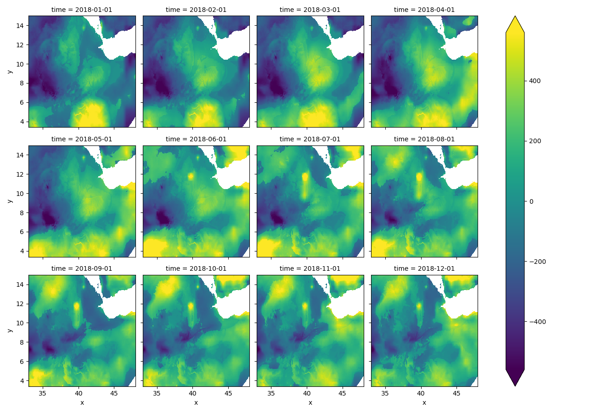

 
<!-- compile working with:
pandoc writeup.md --bibliography=refs.bib --filter pandoc-citeproc --pdf-engine=xelatex -o output.pdf-->
 
## Statement of need

Gridded time series data from satellites, climate models, camera feeds, and sensors contain rich temporal information for applications like crop type classification and yields, anomaly detection, robotics, quality control, environmental monitoring, and natural resource management [@delince2017handbook;@mumuni2024automated;@hufkens2019monitoring;@MANN201760;@mann2019predicting]. Efficiently extracting relevant time series features at scale remains challenging, necessitating automation [@faouzi2022time;@li2020forecasting]. Inspired by `tsfresh`, we introduce `xr_fresh`, tailored specifically for gridded time series by automating the extraction of time series features on a pixel-by-pixel basis [@CHRIST201872].

Currently, there is no method to rapidly extract a comprehensive set of features from gridded time series data, such as those derived from remote sensing imagery. Existing packages like `tsfresh` are not optimized for the unique structure of gridded time series data. This limitation hinders the ability to efficiently analyze and model these datasets, particularly in the context of remote sensing applications where large volumes of data are generated.

To address this gap, `xr_fresh` automates the extraction of salient temporal and statistical features from each pixel time series. Using automated feature extraction, `xr_fresh` reduces manual intervention and improves reproducibility in remote sensing workflows.

## Problems and Background

An image time series can be represented as a three-dimensional array with spatial dimensions $x$ and $y$, and temporal dimension $z$. Each pixel at location $(x_i, y_j)$ holds a time series:

$$
\mathcal{D} = \{ X_{i,j} \in \mathbb{R}^T \mid i = 1, \ldots, H; j = 1, \ldots, W \}
$$

where $H$ and $W$ are the height and width of the image, and $T$ is the number of temporal observations (e.g. monthly composites or daily acquisitions).

To prepare these data for use in supervised or unsupervised machine learning, each pixel time series $X_{i,j} = (x_{i,j,1}, x_{i,j,2}, \ldots, x_{i,j,T})$ is transformed into a feature vector:

$$
\vec{x}_{i,j} = \left(f_1(X_{i,j}), f_2(X_{i,j}), \ldots, f_M(X_{i,j})\right)
$$

where each $f_m$ is a time series feature extraction function (e.g. mean, variance, trend, autocorrelation), and $M$ is the total number of extracted features.

A visual representation of this transformation is shown in Figure 1.  


This results in a 2D design matrix of features for the entire image:

$$
\mathbf{X}_{\text{features}} \in \mathbb{R}^{H \times W \times M}
$$

This transformation effectively reduces the temporal complexity while preserving informative temporal patterns, enabling efficient training of models or aggregation to coarser units (e.g., fields or regions).

Additional static features (e.g., soil type, elevation), can be concatenated:

$$
\vec{x}_{i,j}^\text{final} = \left[ \vec{x}_{i,j} \,|\, \vec{a}_{i,j} \right] \in \mathbb{R}^{M + U}
$$

where $\vec{a}_{i,j} \in \mathbb{R}^U$ represents the $U$ univariate attributes at pixel $(i, j)$.

### Time Series Feature Set

The [documentation](https://mmann1123.github.io/xr_fresh/feature_calculator_series.html) summarizes the suite of time series features extracted by the `xr_fresh` module from gridded data. These features are designed to characterize the temporal behavior of each pixel $(x_i, y_j)$. By including a diverse set of statistical, trend and distribution-based metrics, `xr_fresh` enables a detailed and scalable analysis of temporal patterns [@jin2022automated;@venkatachalam2024temporal]. Additional features can be added to the library as needed, and users can also define custom feature extraction functions.

### Interpolation

The `xr_fresh` library includes functionality to interpolate missing values pixel-wise in gridded data. The interpolation methods implemented in `xr_fresh` are designed to be computationally efficient and can handle large datasets effectively. The module supports advanced interpolation techniques including linear, nearest-neighbor, cubic, and univariate spline interpolation [@virtanen2020scipy].  

Formally, for a fixed pixel $(i, j)$, let the time series be:

$$
X_{i,j} = (x_{i,j,1}, x_{i,j,2}, \ldots, x_{i,j,T})
$$

where some $x_{i,j,t}$ may be missing due to clouds or sensor gaps. The interpolation estimates these missing values by fitting a function $f(t)$ to the observed time steps $\{t_k \in [1, T] \mid x_{i,j,t_k} \text{ is observed} \}$. The interpolated value at time $t$ is:

$$
\hat{x}_{i,j,t} = f(t), \quad \text{for } x_{i,j,t} \text{ missing}
$$

The function $f(t)$ may take the form of: 1) linear interpolation, 2) nearest neighbor, 3) cubic spline interpolation, or 4) univariate spline interpolation. If acquisition times are irregular, the time $t$ is replaced by a continuous index (e.g. datetime indexes).

### Dimensionality Reduction

For high-dimensional inputs or when the number of bands/time steps is large, dimensionality reduction can improve model performance. `xr_fresh` integrates a GPU/CPU-parallelized Kernel Principal Component Analysis (KPCA) module [@scikit-learn]. The KPCA implementation samples valid observations for training, fits the kernel model, and projects each pixel’s time series into a lower-dimensional space. 

## Software Framework

`xr_fresh` achieves scalability by employing a combination of parallel and distributed computing strategies. During feature extraction, functions are applied in parallel across spatial windows with Dask and xarray, which provide lazy evaluation, chunked computation [@geowombat;@hoyer2017xarray;@rocklin2015dask]. Seamlessly integrated into the parallel pipeline and can leverage accelerated libraries like JAX, NumPy, ray, numba or PyTorch for additional speedup [@jax2018github;lam2015numba;@harris2020array;@moritz2018ray]. Together, these strategies ensure that methods are highly scalable, for use on large-scale datasets.

## Example: Precipitation In Africa

We apply `xr_fresh` methods to a dataset of monthly precipitation estimates in East Africa, in Figure 2 [@funk2015climate]. The goal is to extract features from the time series data, enabling subsequent analysis and modeling. The `extract_features_series` function takes a list of files, a dictionary of desired features.




```python
# create list of desired series and arguments
feature_list = {
    "minimum": [{}],
    "abs_energy": [{}],
    "doy_of_maximum": [{"dates": dates}],
    "mean_abs_change": [{}],
    "ratio_beyond_r_sigma": [{"r": 1}, {"r": 2}],
    "symmetry_looking": [{}],
    "sum": [{}],
    "quantile": [{"q": 0.05}, {"q": 0.95}],
}
from xr_fresh.extractors_series import extract_features_series

# Extract features from the geospatial time series
extract_features_series(image_list, feature_list, band_name, out_dir, 
                        num_workers=12, nodata=-9999)
```


The extracted features found in Figure 3 can then be used in a variety of applications.

## Conclusions

`xr_fresh` is a powerful and efficient tool for automated feature extraction from gridded time series. Using advanced statistical methods and parallel computing, it enables the extraction of a comprehensive set of features that can significantly enhance the performance of machine learning models. Integration with existing Python geospatial libraries ensures that `xr_fresh` is easy to use and can be seamlessly incorporated into existing machine learning workflows. It also provides advanced interpolation and dimensionality reduction capabilities, addressing common challenges in remote sensing data analysis.  Overall, `xr_fresh` represents a significant advancement in the field of remote sensing feature extraction, providing researchers and practitioners with a powerful tool for analyzing complex temporal patterns in satellite or repeat imagery.

 
```{=latex}
\newpage
```

# References
