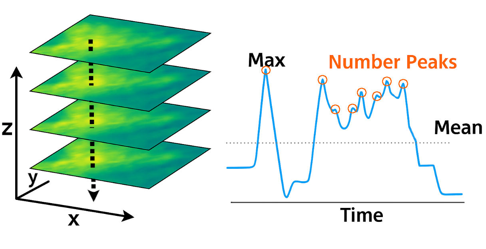
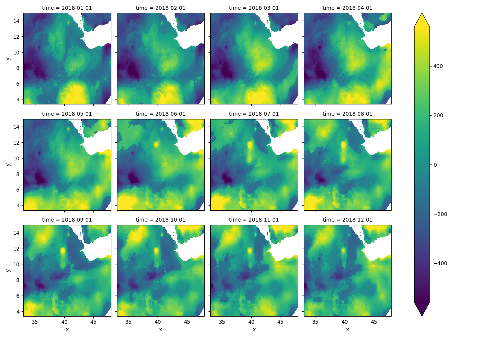
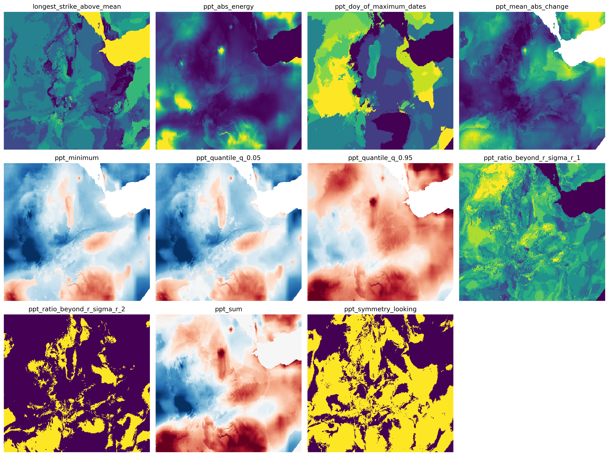

Keywords: Remote sensing, feature extraction, time series, machine learning, crop classification, xarray, Dask.
 
<!-- compile working with:
pandoc writeup.md --bibliography=refs.bib --filter pandoc-citeproc --pdf-engine=xelatex -o output.pdf-->

<!-- pandoc writeup.md --template=mytemplate.tex -o output.pdf --bibliography=refs.bib --pdf-engine=xelatex --filter pandoc-citeproc -->

 
<!-- convert to word doc (2 steps)  --template=mytemplate.tex \
pandoc writeup.md 
  --from markdown+raw_tex \
  --to latex \
  --bibliography=refs.bib \
  --filter pandoc-citeproc\
  -o output.tex

pandoc output.tex --from latex --to docx -o output.docx
--> 
<!-- 
Look at https://mpastell.com/pweave/docs.html -->

## Introduction

Recent advancements in satellite technology and sensor data have significantly enhanced our capability to monitor environmental phenomena through time series analysis of images. Efficiently extracting relevant time series features at scale remains challenging, necessitating automated and robust methods. Inspired by `tsfresh` (Time Series FeatuRe Extraction on basis of Scalable Hypothesis tests), we introduce `xr_fresh`, tailored specifically for image time series,by automating the extraction of time series features on a pixel-by-pixel basis [@CHRIST201872].

Time series data, characterized by sequences of measurements indexed over time, are ubiquitous in diverse fields, including finance, healthcare, industrial monitoring, and environmental sciences [@faouzi2022time]. Analyzing and modeling these temporal sequences for tasks such as classification (assigning a time series to a predefined category) or regression (predicting a continuous value associated with a time series) is a fundamental problem in machine learning [@faouzi2022time]. However, applying standard machine learning algorithms directly to raw time series data is often challenging due to the inherent temporal structure and potentially high dimensionality of the sequences [@faouzi2022time]. An effective representation of the time series characteristics is crucial for building accurate and robust models [@mumuni2024automated;@faouzi2022time].

Traditional approaches to time series analysis and machine learning often rely on manual feature engineering, a process in which domain experts handcraft relevant features from raw data [@li2020forecasting]. Although effective in specific contexts, this process is labor intensive, requires significant expertise, and may not generalize well across different datasets or tasks [@li2020forecasting;@faouzi2022time]. The increasing volume and complexity of modern time series data require more automated and scalable approaches to data processing and feature extraction  [@mumuni2024automated;@li2020forecasting].

A prominent tool in this domain is `tsfresh` [@CHRIST201872], a Python package specifically designed for time series feature extraction based on scalable hypothesis tests   [jin2022automated;@mumuni2024automated;@gilpin2021chaos;@schroeder2019chemiresistive;@sylligardos2023choose;@mcdermott2023event;@petropoulos2022forecasting;@zhao2022ai]. `tsfresh` automates the process of calculating a diverse and large number of features from time series data. These features are derived from existing research and include distribution properties (e.g., mean, standard deviation, kurtosis), measures of autocorrelation (e.g., fast Fourier transform (FFT) and power spectral density coefficients), properties of linear regressors (e.g., gradient, standard error), energy, entropy, and stochasticity [@CHRIST201872]. After feature extraction, `tsfresh` also offers automated feature selection methods, such as using statistical tests like the Mann-Whitney U test, to identify and select the most relevant features for a specific task [@CHRIST201872].

Gridded time series data from satellites, climate models, camera feeds, and sensors contain rich temporal information for applications like crop type classification and yields, anomaly detection, robotics, quality control, environmental monitoring, and natural resource management [@delince2017handbook;@mumuni2024automated;@hufkens2019monitoring;@MANN201760;@mann2019predicting]. Traditional methods relied heavily on manually engineered features, which are time-consuming, require domain expertise, and often lack scalability.

Deep learning (DL) has largely supplanted traditional machine learning (ML) methods in a variety of fields, including the analysis of gridded remote sensing data [@LI2023103345;@MA2019166]. This shift is attributed to the capabilities of DL algorithms in handling the massive volume and complexity of remote sensing big data (RSBD) [@LI2023103345]. Traditional methods have largely relied on hand-crafted feature descriptors which are effective only in limited situations and struggle to balance generalization and robustness when dealing with RSBD [@delince2017handbook]. In contrast, deep learning models automatically extract rich hierarchical features directly from the data, learning weights from vast amounts of information. This ability to learn deep representative features is particularly effective for multi-temporal remote sensing data analysis, such as crop type mapping. Although traditional ML methods such as Random Forest, Decision Trees, and Support Vector Machines have been successfully applied to classify different crop types, they typically rely on shallow and hand-crafted features and struggle to capture the complex temporal patterns of crop growth [@zhang2024improving]. Compared to traditional ML models, deep learning models often have a much larger number of trainable parameters and, when trained with sufficient data or augmented techniques, can learn more comprehensive and generalized features, sometimes achieving comparable or superior accuracy even with fewer training samples [@zhang2024improving]. The rapid development of computing power and the availability of big data have enabled deep learning to surpass traditional methods in various remote sensing tasks, including scene classification, object detection, semantic segmentation, change detection, and land use and land cover (LULC) classification [@LI2023103345;@MA2019166;@LI2023103345]. Although traditional ML is still used, the remote sensing community has notably shifted its focus to deep learning since around 2014 due to its significant success in many image analysis tasks [@MA2019166].

Traditional machine learning approaches are well suited for analyzing gridded time series data from a variety of sources, including remote sensing platforms, in ssitu sensors, and climate reanalysis products. These methods can effectively leverage spatial and temporal patterns within the data, capturing key trends and anomalies across environmental variables  [@begue2018remote;@delince2017handbook]. Compared to deep learning architectures, traditional machine learning offers greater interpretability and lower computational overhead [@hohl2024recent]. In a recent study, `xr_fresh` ML methods outperformed a variety of deep learning methods for crop classification using monthly Sentinel-2 images [@venkatachalam2024temporal]. Their transparent decision-making processes can be easily examined by domain experts, communicated to non-technical stakeholders, and they typically require less training data and computational power, making them ideal for many operational or resource-constrained applications, such as on edge devices or research in developing countries [@hohl2024recent;@rs13132591;@LI2023103345;@MA2019166]. Currently, there is no method to rapidly extract a comprehensive set of features from gridded time series data, such as those derived from remote sensing imagery. Existing packages like `tsfresh` are not optimized for the unique characteristics of gridded time series data, which often include irregular sampling intervals, missing values, and high dimensionality. This limitation hinders the ability to efficiently analyze and model these datasets, particularly in the context of remote sensing applications where large volumes of data are generated.

To address this gap, `xr_fresh` automates the extraction of salient temporal and statistical features from each pixel time series. Using automated feature extraction, `xr_fresh` reduces manual intervention and improves reproducibility in remote sensing workflows.

## Problems and Background

An image time series can be represented as a three-dimensional array with spatial dimensions $x$ and $y$, and temporal dimension $z$. Each pixel at location $(x_i, y_j)$ holds a time series:

$$
\mathcal{D} = \{ X_{i,j} \in \mathbb{R}^T \mid i = 1, \ldots, H; j = 1, \ldots, W \}
$$

where $H$ and $W$ are the height and width of the image, and $T$ is the number of temporal observations (e.g. monthly composites or daily acquisitions).

To prepare these data for use in supervised or unsupervised machine learning, each pixel time series $X_{i,j} = (x_{i,j,1}, x_{i,j,2}, \ldots, x_{i,j,T})$ is transformed into a feature vector:

$$
\vec{x}_{i,j} = \left(f_1(X_{i,j}), f_2(X_{i,j}), \ldots, f_M(X_{i,j})\right)
$$

where each $f_m$ is a time series feature extraction function (e.g. mean, variance, trend, autocorrelation), and $M$ is the total number of extracted features.

A visual representation of this transformation is shown in Figure 1. The feature extraction process is applied to each pixel's time series, resulting in a feature vector $\vec{x}_{i,j}$ for each pixel $(i,j)$.

\newpage


This results in a 2D design matrix of features for the entire image:

$$
\mathbf{X}_{\text{features}} \in \mathbb{R}^{H \times W \times M}
$$


This transformation effectively reduces the temporal complexity while preserving informative temporal patterns, enabling efficient training of spatial models or further aggregation to coarser spatial units (e.g., fields or regions).

If additional static features are available per pixel (e.g., soil type, elevation), these can be concatenated:

$$
\vec{x}_{i,j}^\text{final} = \left[ \vec{x}_{i,j} \,|\, \vec{a}_{i,j} \right] \in \mathbb{R}^{M + U}
$$

where $\vec{a}_{i,j} \in \mathbb{R}^U$ represents the $U$ univariate attributes at pixel $(i, j)$.

### Time Series Feature Set

The table below summarizes the suite of time series features extracted by the `xr_fresh` module from imagery. These features are designed to characterize the temporal behavior of each pixel $(x_i, y_j)$, capturing key aspects of, for instance crop phenology and seasonal dynamics. By including a diverse set of statistical, trend and distribution-based metrics, `xr_fresh` enables a detailed and scalable analysis of temporal patterns found to be relevant to time series applications of imagery [@jin2022automated]. Additional features can be added to the library as needed, and users can also define custom feature extraction functions.
 
```{=latex}

\renewcommand{\arraystretch}{1.5}  
\begin{longtable}{|p{4cm}|p{5cm}|p{6cm}|}
\hline
\textbf{Statistic} & \textbf{Description} & \textbf{Equation} \\
\hline
\endhead
Absolute energy &  sum over the squared values & $\sum_{i=1}^n x_i^2$ \\
Absolute Sum of Changes  & sum over the absolute value of consecutive changes in the series  & $ \sum_{i=1}^{n-1} \mid x_{i+1}- x_i \mid $ \\
Autocorrelation (1 \& 2 month lag) & Correlation between the time series and its lagged values & $\frac{1}{(n-l)\sigma^{2}} \sum_{t=1}^{n-l}(X_{t}-\mu )(X_{t+l}-\mu)$\\
Count Above Mean & Number of values above the mean & $\sum_{i=1}^n (x_i > \bar{x})$ \\
Count Below Mean & Number of values below the mean & $\sum_{i=1}^n (x_i < \bar{x})$ \\Day of Year of Maximum Value & Day of the year when the maximum value occurs in series & --- \\
Day of Year of Minimum Value & Day of the year when the minimum value occurs in series & --- \\
Kurtosis Excess & Excess kurtosis, measuring the "tailedness" of the distribution beyond normal & 
$\frac{\mu_4}{\sigma^4} - 3$   \\
Large Standard Deviation & Boolean variable denoting if the standard deviation of $x$ is higher than $r$ times the range & $\left(\mathrm{std}(x) > r \cdot (\max(X) - \min(X))\right)$ \\
Linear Time Trend & Linear trend coefficient estimated over the entire time series & $\frac{\sum_{i=1}^n (x_i - \bar{x})(t_i - \bar{t})}{\sum_{i=1}^n (x_i - \bar{x})^2}$ \\
Longest Strike Above Mean & Longest consecutive sequence of values above the mean & --- \\
Longest Strike Below Mean & Longest consecutive sequence of values below the mean & --- \\
Maximum & Maximum value of the time series & $x_{\text{max}}$ \\
Mean & Mean value of the time series & $\frac{1}{n}\sum_{i=1}^n x_i$ \\
Mean Absolute Change & Mean of absolute differences between consecutive values & $\frac{1}{n-1} \sum_{i=1}^{n-1} | x_{i+1} - x_{i}|$ \\
Mean Change & Mean of the differences between consecutive values & $ \frac{1}{n-1} \sum_{i=1}^{n-1}  x_{i+1} - x_{i} $ \\
Mean Second Derivative Central & measure of acceleration of changes in a time series data & $\frac{1}{2(n-2)} \sum_{i=1}^{n-1}  \frac{1}{2} (x_{i+2} - 2 \cdot x_{i+1} + x_i)
$ \\
Median & Median value of the time series & $\tilde{x}$ \\
Minimum & Minimum value of the time series & $x_{\text{min}}$ \\
Quantile (q = 0.05, 0.95) & Values representing the specified quantiles (xth percentiles) & $Q_{0.05}, Q_{0.95}$ \\
Ratio Beyond r Sigma (r=1,2,3) & Proportion of values beyond r standard deviations from the mean & $\frac{1}{n}\sum_{i=1}^{n} (|x_i - \bar{x}| > r\sigma_{x})$ \\
Skewness & Measure of the asymmetry of the time series distribution & $\frac{n}{(n-1)(n-2)} \sum \left(\frac{X_i - \overline{X}}{s}\right)^3$ \\
Standard Deviation & Standard deviation of the time series & $  \sqrt{\frac{1}{N}\sum_{i=1}^{n} (x_i - \bar{x})^2}$ \\
Sum Values & Sum of all values in the time series & $\sum_{i=1}^{n} x_i$ \\
Symmetry Looking & Measures the similarity of the time series when flipped horizontally & $| x_{\text{mean}}-x_{\text{median}} | < r * (x_{\text{max}} - x_{\text{min}} ) $ \\
Time Series Complexity (CID CE) & measure of number of peaks and valleys & $\sqrt{ \sum_{i=1}^{n-1} ( x_{i} - x_{i-1})^2 }$\\
Variance & Variance of the time series & $\frac{1}{N}\sum_{i=1}^{n} (x_i - \bar{x})^2$ \\
Variance Larger than Standard Deviation & check if variance is larger than standard deviation & $\sigma^2 > 1$ \\
\hline
\end{longtable}
```

### Additional Functionality  

Two common challenges in image time series data are the presence of missing values, and the high dimensionality of the data. The `xr_fresh` library addresses these issues through advanced interpolation techniques and dimensionality reduction methods.

#### Interpolation

The `xr_fresh` library includes functionality to interpolate missing values in the time series data. This is crucial to ensure that the feature extraction process is not hindered by gaps in the data, which are common in remote sensing applications due to cloud cover or sensor errors. The interpolation methods implemented in `xr_fresh` are designed to be computationally efficient and can handle large datasets effectively. The module supports advanced interpolation techniques including linear, nearest-neighbor, cubic, and univariate spline interpolation. These methods can utilize either regular intervals or explicitly provided date vectors to guide the interpolation along the temporal (z) dimension. Interpolation is applied pixel-wise to reconstruct continuous temporal profiles before feature extraction.

Formally, for a fixed pixel $(i, j)$, let the time series be:

$$
X_{i,j} = (x_{i,j,1}, x_{i,j,2}, \ldots, x_{i,j,T})
$$

where some $x_{i,j,t}$ may be missing due to clouds or sensor gaps. The interpolation estimates these missing values by fitting a function $f(t)$ to the observed time steps $\{t_k \in [1, T] \mid x_{i,j,t_k} \text{ is observed} \}$. The interpolated value at time $t$ is:

$$
\hat{x}_{i,j,t} = f(t), \quad \text{for } x_{i,j,t} \text{ missing}
$$

The function $f(t)$ may take the form of:

* **Linear interpolation:** $f(t) = a t + b$
* **Nearest neighbor:** $f(t) = x_{i,j,t_k}$ where $t_k = \arg\min_{t_k} |t - t_k|$
* **Cubic spline interpolation:** smooth piecewise cubic polynomials with continuity up to the second derivative
* **Univariate spline interpolation:** minimizes the penalized error

$$
\sum_k (x_{i,j,t_k} - f(t_k))^2 + \lambda \int (f''(t))^2 dt
$$

If acquisition times are irregular, the time $t$ is replaced by a continuous index (e.g. datetime indexes).

#### Dimensionality Reduction

For high-dimensional inputs or when the number of bands/time steps is large, dimensionality reduction can improve model performance. `xr_fresh` integrates a GPU/CPU-parallelized Kernel Principal Component Analysis (KPCA) module using a radial basis function (RBF) kernel. The KPCA implementation samples valid observations for training, fits the kernel model, and projects each pixel’s time series into a lower-dimensional space. The transformation is parallelized across spatial blocks using Ray and compiled with Numba for fast evaluation.

Formally, let $\mathbf{x}_{i,j} \in \mathbb{R}^T$ denote the time series vector for pixel $(i, j)$, where $T$ is the number of time steps or bands. KPCA first computes the kernel matrix $K$ using the RBF kernel:

$$
K(\mathbf{x}_a, \mathbf{x}_b) = \exp\left(-\frac{\|\mathbf{x}_a - \mathbf{x}_b\|^2}{2\sigma^2}\right)
$$

where $\sigma$ is the kernel bandwidth parameter. The kernel matrix $K \in \mathbb{R}^{N \times N}$ (with $N$ the number of sampled pixels) is then centered and eigendecomposed:

$$
K_c = K - \mathbf{1}_N K - K \mathbf{1}_N + \mathbf{1}_N K \mathbf{1}_N
$$

where $\mathbf{1}_N$ is an $N \times N$ matrix with all entries $1/N$. The top $d$ eigenvectors $\{\mathbf{v}_1, \ldots, \mathbf{v}_d\}$ corresponding to the largest eigenvalues are selected, and each pixel time series is projected into the reduced space:

$$
\mathbf{z}_{i,j} = [\alpha_1 k(\mathbf{x}_{i,j}, \cdot), \ldots, \alpha_d k(\mathbf{x}_{i,j}, \cdot)]
$$

where $\alpha_k$ are the normalized eigenvectors. This yields a lower-dimensional representation $\mathbf{z}_{i,j} \in \mathbb{R}^d$ for each pixel, capturing the principal nonlinear temporal patterns in the data.

## Software Framework

`xr_fresh` achieves scalability by employing a combination of parallel and distributed computing strategies throughout both the feature extraction and dimensionality reduction stages. During feature extraction, functions are applied in parallel across spatial windows of the dataset using the `geowombat.series` context manager [@geowombat]. The `apply` method enables multicore processing via the `num_workers` parameter, distributing computation over spatial blocks (such as 256×256 pixel windows) and efficiently utilizing all available CPU cores or distributed resources. Users can further extend functionality by defining custom feature extraction modules through subclassing `gw.TimeModule`, which are seamlessly integrated into the parallel pipeline and can leverage accelerated libraries like JAX, NumPy, or PyTorch for additional speedup.

For high-dimensional data, dimensionality reduction (such as Kernel PCA) is performed in a distributed manner. The data set is divided into spatial chunks, each processed in parallel using Ray, a distributed execution framework. Within each chunk, Numba-compiled functions (using `@numba.jit(nopython=True, parallel=True)`) accelerate the transformation and exploit multi-threading at the block level. This two-level parallelism—across blocks with Ray and within blocks with Numba—enables efficient scaling to very large datasets. The architecture is further supported by integration with Dask and xarray, which provide lazy evaluation, chunked computation, and seamless scaling from single machines to distributed clusters. Together, these strategies ensure that both feature extraction and dimensionality reduction are highly scalable, making `xr_fresh` suitable for operational use on large-scale image datasets.

## Example: Precipitation In Africa

As a demonstration of `xr_fresh`, we applied the package to a dataset of monthly precipitation estimates in East Africa, derived from the CHIRPS dataset in Figure 2 [@funk2015climate]. The goal was to extract features from the time series data for each pixel, enabling subsequent analysis and modeling.



```python
# create list of desired series
feature_list = {
    "minimum": [{}],
    "abs_energy": [{}],
    "doy_of_maximum": [{"dates": dates}],
    "mean_abs_change": [{}],
    "ratio_beyond_r_sigma": [{"r": 1}, {"r": 2}],
    "symmetry_looking": [{}],
    "sum": [{}],
    "quantile": [{"q": 0.05}, {"q": 0.95}],
}
from xr_fresh.extractors_series import extract_features_series

# Extract features from the geospatial time series
extract_features_series(image_list, feature_list, band_name, out_dir, num_workers=12, nodata=-9999)
```

The above code snippet demonstrates the use of `xr_fresh` to extract a set of features from the CHIRPS precipitation dataset. The `extract_features_series` function takes a list of files, a dictionary of desired features, and other parameters such as the band name and temporary directory for intermediate storage. The `num_workers` parameter allows for parallel processing across multiple CPU cores, significantly speeding up the feature extraction process.



The extracted features found in Figure 3 can then be used for various applications, such as machine learning modeling, anomaly detection, or time series analysis. The flexibility of `xr_fresh` allows users to customize the feature extraction process according to their specific needs and datasets.

## Conclusions

`xr_fresh` is a powerful and efficient tool for automated feature extraction from gridded time series from imagery. Using advanced statistical methods and parallel computing, it enables the extraction of a comprehensive set of features that can significantly enhance the performance of machine learning models. Integration with existing Python geospatial libraries ensures that `xr_fresh` is easy to use and can be seamlessly incorporated into existing machine learning workflows. It also provides advanced interpolation and dimensionality reduction capabilities, addressing common challenges in remote sensing data analysis.  Overall, `xr_fresh` represents a significant advancement in the field of remote sensing feature extraction, providing researchers and practitioners with a powerful tool for analyzing complex temporal patterns in satellite imagery.


### Acknowledgements and Dependencies

The development of `xr_fresh` builds upon a robust ecosystem of open-source scientific Python libraries. We gratefully acknowledge the following projects, which provide essential functionality for numerical computation, geospatial analysis, and scalable data processing:

- **tsfresh** [@CHRIST201872]: Automated time series feature extraction based on scalable hypothesis tests.
- **JAX** [@jax2018github]: High-performance numerical computing and automatic differentiation.
- **Numba** [@lam2015numba]: Just-in-time compilation for accelerating Python code.
- **scikit-learn** [@scikit-learn]: Machine learning algorithms and utilities.
- **geowombat** [@geowombat]: Geospatial raster data processing and analysis.
- **xarray** [@hoyer2017xarray]: Labeled, multi-dimensional arrays for scientific data.
- **SciPy** [@virtanen2020scipy]: Scientific computing routines for Python.
- **NumPy** [@harris2020array]: Fundamental array programming for numerical computing.
- **Dask** [@rocklin2015dask]: Parallel and distributed computing for large datasets.
- **geowombat** [@geowombat]: Flexible framework for large-scale geospatial raster processing and analysis.
- **Ray** [@moritz2018ray]: Distributed computing framework for parallelizing Python code.


These libraries form the computational backbone of `xr_fresh`, enabling efficient, scalable, and reproducible remote sensing workflows.

```{=latex}
\newpage
```

# References
